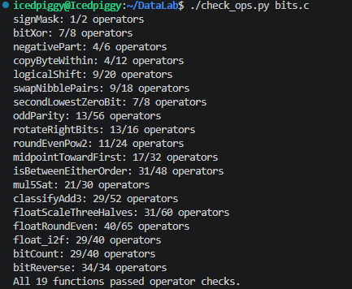
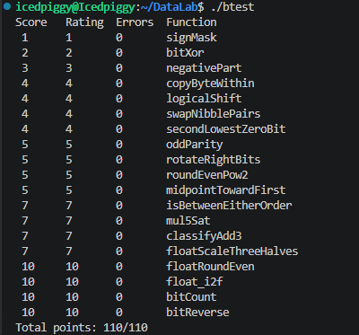

# DataLab 实验报告

林诗航 24300240228

### 运行结果截图

### 思路

1. `signMask`: 直接将 1 左移 31 位即可。 
2. `bitXor`: 异或结果中某一位为 1，也就是这一位出现 1 的次数既不为 2 `(x&y)` 也不为 0 `(~x&~y)`。
3. `negativePart`: `x >> 31` 在符号位为 1 时为 `0xffffffff`，符号位为 0 时为 `0`，是很常用的 mask，另使用 `~x + 1` 得到 -x。
4. `copyByteWithin`: 给一个字节清零的操作太麻烦，可以直接使用异或，将两次右移的结果异或并按位与 `0xff`，再将该字节拿去异或。
5. `logicalShift`: 逻辑右移，需要把符号位单独处理，剩下的部分正常算术右移。
6. `swapNibblePairs`: 创建 `0x0f0f0f0f` 的 mask，无需创建 `0xf0f0f0f0` 的 mask 或取反，第一部分为 x 先 mask 再左移，第二部分为 x 先右移再 mask，将两部分合并，这样无需处理符号位。
7. `secondLowestZeroBit`: x 的最低位的 1 为 `x & -x = x & (~x + 1)`，那么最低位的 0 为 `~x & (x + 1)`，先得到将最低位 0 置 1 的 y，再求一次最低位的 0。
8. `oddParity`: 将 x 前后 16b 拆开并异或为 16b 数不改变 parity，重复该操作直到压成 1b，为了避免符号位问题而使用左移，由于每次操作后 x 的后若干位不会影响结果，因此没有必要将 x 的后若干位清空。
9. `rotateRightBits`: 将符号位单独处理，将不重叠的三部分合并即可。
10. `roundEvenPow2`: 加上 $2^{n-1}$，若后 n bit 为 0，则第 n 位置零。
11. `midpointTowardFirst`: 即计算 C 语言下的 `x + (y - x) / 2`，即绝对值下取整。使用 32b + 1b 的数 s，将 -x 与 y 拆成 31b 与 1b 的两部分分别相加得到 s；将 s 的 1b 部分进位，确保 1b 绝对值小于 2，此时 s 的两部分可能异号；若 32b 与 1b 均不为 0 且异号，那么将 32b 部分加上 1b，否则舍弃 1b；32b 部分即为 `(y - x) / 2`。
12. `isBetweenEitherOrder`: 即 a-x b-x 异号或其中一个为 0，但是 a 与 -x 同号时可以直接确定 a-x 的符号，异号时计算不会溢出。
13. `mul5Sat`: 计算 `floor(2147483648 / 5) = 429496729 = 0x19999999` 减去 x 的绝对值即可确定是否溢出，若溢出则按符号输出特殊值，否则直接算。
14. `classifyAdd3`: 类似 `midpointTowardFirst` 使用 32b + 29b 的数 s；将 s 的 29b 部分进位，确保 1b 绝对值小于 $2^{29}$，此时 s 的两部分可能异号；若 32b 与 29b 均不为 0 且异号，那么做调整；最后根据符号做不同的比较。
15. `floatScaleThreeHalves`: 直接判掉 `e == 0xff` 的 inf 与 nan；提取尾数 m，若 e 大于 0 则为了方便操作将 m 加上 $2^{23}$；对 $3m$ 是否 $\ge 2^{25}$ 的情况做分类讨论，两部分都要 `roundEvenPow2`。
16. `floatRoundEven`：判掉已经为整数的数 `e >= 150`，判掉绝对值小于等于 0.5 结果为 ±0 的数 `e <= 125`，然后做 `roundEvenPow2`，为了方便操作先将 m 加上 $2^{23}$，然后试验加上 $2^{149-e}$，此时 m 可能会大于等于 $2^{24}$，需要多四舍五入一位，此时再加一个 $2^{149-e}$，相当于加了一个 $2^{150-e}$，后续四舍五入 2 位；否则正常四舍五入 1 位。注意，如果不判 ±0.5 且不做后续处理，那么返回的指数 e 不为 0，最方便的方法还是提前判掉。 
17. `float_i2f`: 先求出这个数的对数 l，分类讨论，对于 l > 23 的情况需 `roundEvenPow2`，四舍五入细节参考 `floatRoundEven`。
18. `bitCount`: 可以将 x 视作 32 个 1b 数，相邻 2 个 1b 数相加即可得到 16 个 2b 数，重复以上过程即可，创建 `0x55555555`、`0x33333333`、`0x0f0f0f0f`、`0x00ff00ff`、`0x0000ffff` 的 mask，第一部分为 x 直接 mask，第二部分为 x 右移再 mask，两部分直接相加，产生的进位不会影响其他的数，也无需处理符号位。mask 的构造可以一起做而不是单独做，从而降低次数，如 `0x00ff00ff == 0x0000ffff ^ (0x0000ffff << 8)`。
19. `bitReverse`: 类似 `swapNibblePairs`，多次创建 mask 然后做交换；类似 `bitCount`，mask 的构造可以一起做。